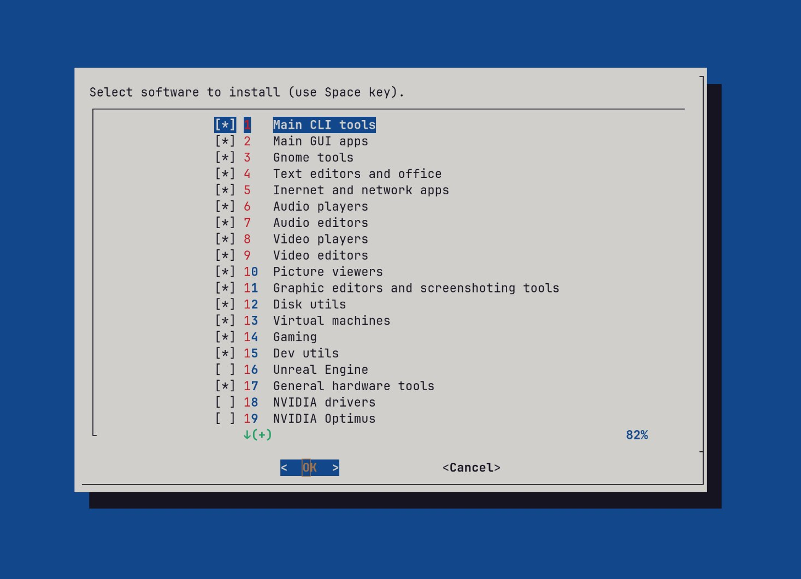

# arch-up

This script allows you to quickly install and configure all the necessary software for Arch Linux.

A gnome with a Nordic theme is used as a desktop. The list contains all the software used by the author of the script, but you can make a fork and edit it as you need.



After installing the programs, all system and software settings are configured (optional). As a result of the configuration, you get a fully configured system, ready-to-work out of the box. You can install everything with default parameters in a virtual machine to see if it will suit you. The default settings will introduce you to the best practices that the script author has found. You can always make a fork and customize everything for yourself.


To download and run the scrpt, execute the following command:

```bash
curl -sL https://raw.githubusercontent.com/dy-sh/arch-up/main/install.sh | bash 
```

You can use a short link, but it may become invalid over time:

```bash
curl -sL https://rb.gy/l6d2h | bash 

### OR:

curl -sL https://t.ly/foMZr | bash 
```

Clone the repository or make a fork and customize the script for yourself. Unnecessary programs can simply be commented out.

```bash
git clone https://github.com/dy-sh/arch-up
cd arch-up
chmod +x ./*.sh
nano install.sh
./install.sh
```

If you want to disable caching to dowload a new version of changes in script:

```bash
curl -sL "https://raw.githubusercontent.com/dy-sh/arch-up/main/install.sh?$(date +%s)" | bash 
```
