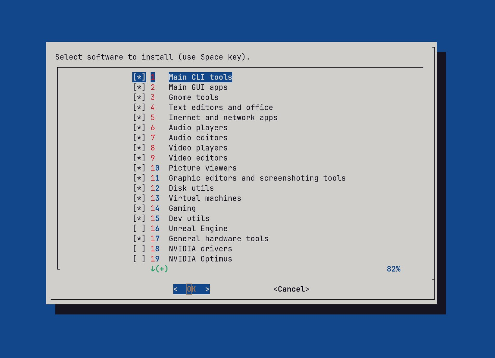
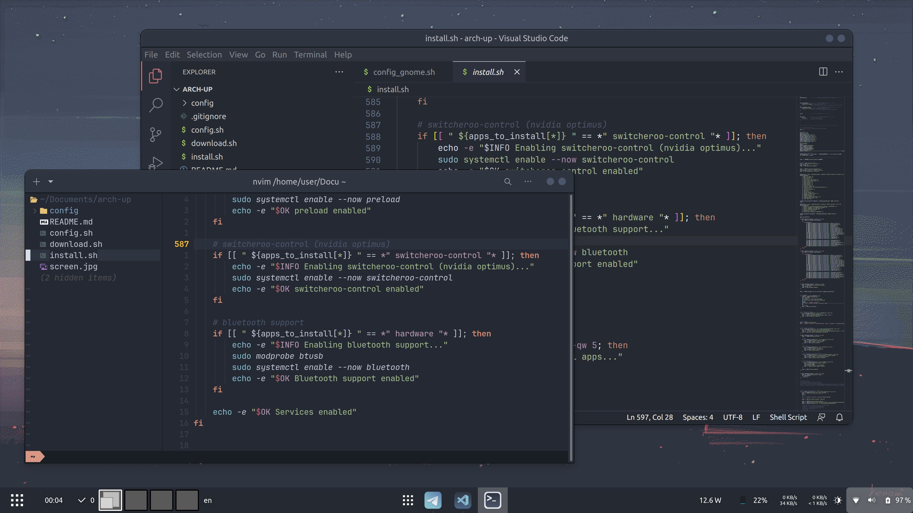
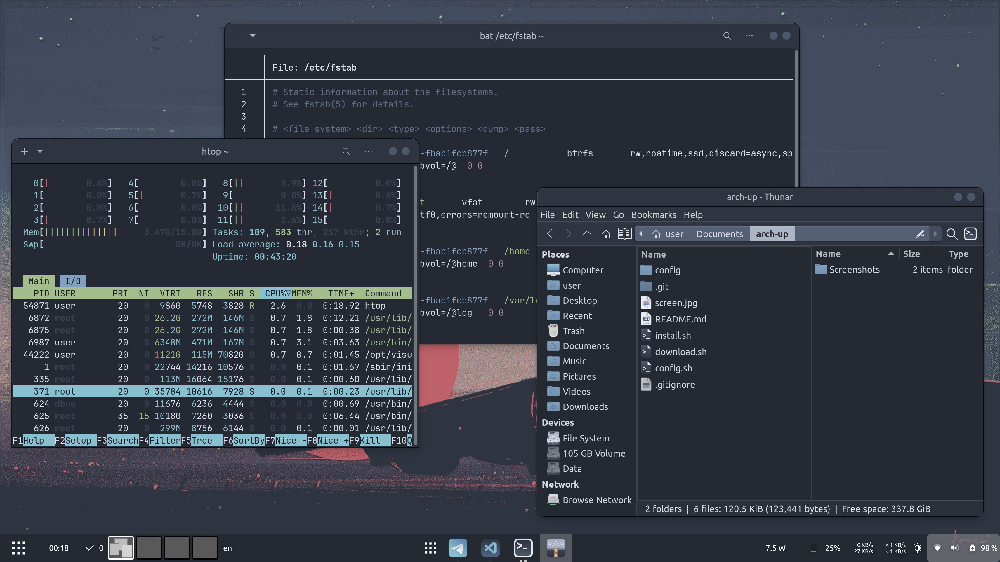

# arch-up

This script allows you to quickly install and configure all the necessary software for Arch Linux.



Desktop environments supported:
- **Gnome**
- **KDE**

The script contains the most necessary software in my opinion,  but you can make a fork and edit it as you need.







After installing the programs, all system and software settings are configured (optional). As a result of the configuration, you get a fully configured system, ready-to-work out of the box. You can install everything with default parameters in a virtual machine to see if it will suit you. The default settings will introduce you to the best practices that the script author has found. You can always make a fork and customize everything for yourself.

### Automatic install

To start the automatic dowloading and execution of the script, run the command:

```bash
curl -sSL https://raw.githubusercontent.com/dy-sh/arch-up/main/download.sh -o arch-up.sh && bash arch-up.sh 
```

You can use a short link, but it may become invalid over time:

```bash
curl -sSL https://rb.gy/5abct -o arch-up.sh && bash arch-up.sh 
```
or:

```bash
curl -sSL https://t.ly/9xK39 -o arch-up.sh && bash arch-up.sh 
```


### Manual install

Clone the repository or make a fork and customize the script for yourself. Unnecessary programs can simply be commented out.

```bash
git clone https://github.com/dy-sh/arch-up
cd arch-up
chmod +x ./*.sh
chmod +x config/*.sh
nano install.sh
./install.sh
```

`install.sh` - is a script that installs all the software from the list inside the script. After installing all the software, it runs `config.sh` (optional).

`config.sh` - is a script that configures all programs. It runs separate scripts for each program in the `config` folder.


